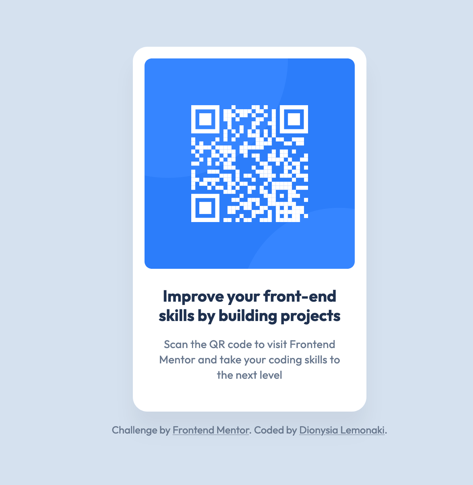

# Frontend Mentor - QR code component solution

This is a solution to the [QR code component challenge on Frontend Mentor](https://www.frontendmentor.io/challenges/qr-code-component-iux_sIO_H). 

## Table of contents

- [Overview](#overview)
  - [Screenshot](#screenshot)
  - [Links](#links)
- [My process](#my-process)
  - [Built with](#built-with)
  - [Useful resources](#useful-resources)
- [Author](#author)

## Overview

### Screenshot

### Links

- [Solution URL](https://www.frontendmentor.io/solutions/qr-code-component-RPH6m1-rIZ)
- [Live site URL](https://fem-qr-code-component-tan.vercel.app/)

## My process

### Built with

- Semantic HTML5 markup
- CSS custom properties
- Flexbox

### Useful resources

- [Self-hosting fonts explained](https://www.youtube.com/watch?v=zK-yy6C2Nck&t=65s) - This video by Kevin Powell taught me how to self-host static Google fonts.
- [google-webfonts-helper](https://gwfh.mranftl.com/fonts) - This tool helped me convert .ttf fonts to .woff2.
- [Invisible Content Just for Screen Reader Users](https://webaim.org/techniques/css/invisiblecontent/) – This article by WebAIM helped me hide content with CSS while making it visible to screen readers. I used the code from the "Absolutely positioning content off-screen" section to pass Axe's accessibility checks on the Frontend Mentor website which were failing because I was missing an `h1` element.

## Author

- [Frontend Mentor](https://www.frontendmentor.io/profile/dionysia-lemonaki)
- [LinkedIn](https://www.linkedin.com/in/dionysia-lemonaki-developer/)
